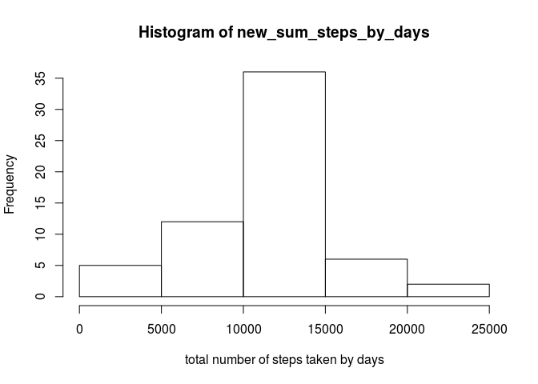

# Reproducible Research: Peer Assessment 1


## Loading and preprocessing the data

```r
unzip("activity.zip", overwrite = F)
```

```
## Warning in unzip("activity.zip", overwrite = F): not overwriting file './
## activity.csv
```

```r
df= read.csv("activity.csv", na.strings = "NA", stringsAsFactors = F)
df$date = as.Date(df$date)
```


## What is mean total number of steps taken per day?

```r
sum_steps_by_days = tapply(df$steps, as.factor(df$date), sum, na.rm=T)
hist(sum_steps_by_days, xlab = 'total number of steps taken by days')
```

 

```r
cat('mean of the steps by days is', mean(sum_steps_by_days, na.rm = T))
```

```
## mean of the steps by days is 9354.23
```

```r
cat('mean of the steps by days is', median(sum_steps_by_days, na.rm = T))
```

```
## mean of the steps by days is 10395
```


## What is the average daily activity pattern?

```r
mean_step_by_interval = tapply(df$steps, as.factor(df$interval), mean, na.rm=T)
plot(as.numeric(names(mean_step_by_interval)), mean_step_by_interval, type='l')
```

 

```r
cat("most ative inverval is", names(which.max(mean_step_by_interval)))
```

```
## most ative inverval is 835
```


## Imputing missing values

```r
cat("The total number of missing values in dataset are:", sum(is.na(df$steps)))
```

```
## The total number of missing values in dataset are: 2304
```

```r
print("filling na with the mean for the 5-minuteinterval")
```

```
## [1] "filling na with the mean for the 5-minuteinterval"
```

```r
df$interval = as.factor(df$interval)
newdf = df
for (i in 1:nrow(newdf)){
  if (is.na(newdf[i,1])){
    newdf[i,1] = mean_step_by_interval[newdf[i,3]]
  }
}
new_sum_steps_by_days = tapply(newdf$steps, as.factor(newdf$date), sum, na.rm=T)
hist(new_sum_steps_by_days, xlab = 'total number of steps taken by days')
```

 

```r
cat('mean of the steps by days is', mean(new_sum_steps_by_days, na.rm = T))
```

```
## mean of the steps by days is 10766.19
```

```r
cat('mean of the steps by days is', median(new_sum_steps_by_days, na.rm = T))
```

```
## mean of the steps by days is 10766.19
```

```r
cat('The difference of previous mean and the mean after imputing is',  mean(new_sum_steps_by_days, na.rm = T) - mean(sum_steps_by_days, na.rm = T))
```

```
## The difference of previous mean and the mean after imputing is 1411.959
```

```r
cat('The difference of previous median and the median after imputing is',  median(new_sum_steps_by_days, na.rm = T) - median(sum_steps_by_days, na.rm = T))
```

```
## The difference of previous median and the median after imputing is 371.1887
```


## Are there differences in activity patterns between weekdays and weekends?

```r
df$weekend = weekdays(df$date)
ind = which(df$weekend =="Saturday" | df$weekend == "Sunday")
df[ind, 'weekend'] = 'weekend'
df[-ind, 'weekend'] = 'weekday'
par(mfrow=c(2,1))
wd = df[which(df$weekend=='weekday'), ]
we = df[which(df$weekend=='weekend'), ]
mean_step_by_interval_we = tapply(we$steps, as.factor(we$interval), mean, na.rm=T)
res1 = data.frame('interval'=names(mean_step_by_interval_we), 'steps' = mean_step_by_interval_we, 'dt' = 'weekend')
mean_step_by_interval_wd = tapply(wd$steps, as.factor(wd$interval), mean, na.rm=T)
res2 = data.frame('interval'=names(mean_step_by_interval_wd), 'steps' = mean_step_by_interval_wd, 'dt' = 'weekday')
res = rbind(res1,res2)
res$dt = as.factor(res$dt)
res$interval = as.numeric(res$interval)
res$steps = as.numeric(res$steps)
require(ggplot2)
```

```
## Loading required package: ggplot2
```

```r
ggplot(res, aes(interval, steps))+geom_line()+facet_grid(dt ~ .)
```

 
